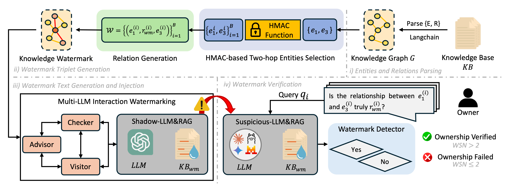

# KNOT

Here, we present **KNOT**, a framework for **KN**owledge **O**wnership via **T**wo-hop Entities in a web-deployed RAG system.



# 1. How to Start.
First, create an virtual environment with Python 3.10. \
Then, install the requirements in the `requirements.txt`.
```
pip install -r requirement.txt
```

# 2. Download the Dataset.
Next, download the five BEIR datasets.
```
python rag/prepare_data.py
```

# 3. Configure your LLM.
Configure LLM by using your API keys in the `model_configs` folder.

# 4. Create Database using ChromaDB.
Creating a Database is necessary. We use ChromaDB for database creation. \
Creation of the database takes a long time due to the immense scale of each dataset.
```
# Taking the construction of nfcorpus database as an example
python rag/vectorstore.py --eval_dataset 'nfcorpus' --eval_model_code "contriever" --score_function 'cosine'
```

# 5. Extract Entities.
We use the [LLM Graph Transformer](https://python.langchain.com/docs/how_to/graph_constructing/) for entity and relation extraction.
```
python entity_generate/generate_entity_llm_check.py --eval_dataset 'nfcorpus' --dataset_prob 1
```

# 6. Create Watermark Triplet.
To create plausible yet stealthy *knowledge watermark*, we first generate a list of two-hop entity pairs.
## 6.1. Find two-hop entities.
HMAC-SHA256 with a secret key is used to generate two-hop entity pairs that only the owner knows.
```
python find_wm_entities.py --base_dir ./output/wm_prepare/nfcorpus --out_tsv ./output/wm_prepare/nfcorpus/wm_links_v3.tsv --out_json ./output/wm_prepare/nfcorpus/wm_links_v3.json
```
## 6.2. Find relation connecting the two-hop entities.
Then, we generate a plausible yet novel relation that connects the two entities to finally create a watermark triplet set $\mathcal{W}=\{(e^{i}_{1}, r^{i}_{wm}, e^{i}_{3})\}_{i=1}^{B}$. We set the budget $B$ to 50 and create 50 watermark triplets.
```
python find_wm_relation.py --dataset_id nfcorpus --max_blocks 50
```
# 7. Create and Inject Watermark Texts.
Next, we create and inject 50 watermark texts into the knowledge base using the multi-LLM interaction.
```
# Creation
python src/main.py --eval_dataset 'nfcorpus' --eval_model_code "contriever" --score_function 'cosine' --doc 1 --inject 0 --verify 0 --stat 0 --mutual_times 10

# Injection
python src/main.py --eval_dataset 'nfcorpus' --eval_model_code "contriever" --score_function 'cosine' --doc 0 --inject 1 --verify 0 --stat 0 --mutual_times 10
```
# 8. Watermark Verification.
Verification is then performed. `--model_name_rllm` refers to the shadow-LLM, and can be changed to various language models configured in the  `model_config` folder. (gpt3.5, claude, gemini, llama, vicuna, mistral)
```
# Verification
python src/main.py --eval_dataset 'nfcorpus' --eval_model_code "contriever" --score_function 'cosine' --model_name_rllm gpt3.5 --doc 0 --inject 0 --verify 1 --stat 1 --mutual_times 10
```
# 9. Results.
The verification results is as follows.

- KNOT (our method) achieves reliable and high WSN values across five datasets and six LLMs. WSN higher than 3 is needed to claim ownership.

## 9.1. Text quality.
Our method achieves higher text quality, leading to successful watermarking in RAG systems.

- GPT 4o is used as a judge to evaluate the quality of the injected watermark texts.

The following code is used to evaluate the texts.
```
python get_scores.py
```

## 9.2. Stealthiness.
Our method achieves higher stealthiness, making it impossible to distinguish between normal and watermark texts.

- LLaMa 3.1 8B Instruct is used to caculate the perplexity of 2,000 normal texts and 50 KNOT and RAG-WM generated texts.

The following code is used to gain perplexity.
```
python calculate_ppl.py --dataset nfcorpus --base /mnt/ssd/TSF/knot-main/output/wm_generate --subdir 10 --model_name meta-llama/Meta-Llama-3.1-8B-Instruct --gpu_id 0
```

## 9.3 Perfomance in QA.
Our method has minimal effect on the knowledge base, presenting good alignment with clean knowledge base.


The following code is used to evaluate performance alignment.
```
# Perform QA
./run_main_QA_all.sh

# Evalulate CDPA
./run_compute_cdpa.sh

# Evalulate CIRA
python src/compute_cira.py 
  --clean /mnt/ssd/TSF/knot-main/output/main_task/nfcorpus/clean_main_task.json \
  --wm    /mnt/ssd/TSF/knot-main/output/main_task/nfcorpus/wm_main_task.json \
  --k 5
```

# 10. Sentence Examples.
We present the generated sentences of both KNOT and RAG-WM in `wminject_sentences_knot.csv` and `wminject_sentences_ragwm.csv` in `./output/wm_generate/{dataset}/10` folder.


# Acknowledgement.
We are super grateful for the following awesome project when implementing KNOT.

- [RAG-WM](https://github.com/873984419/ragwm/tree/main)